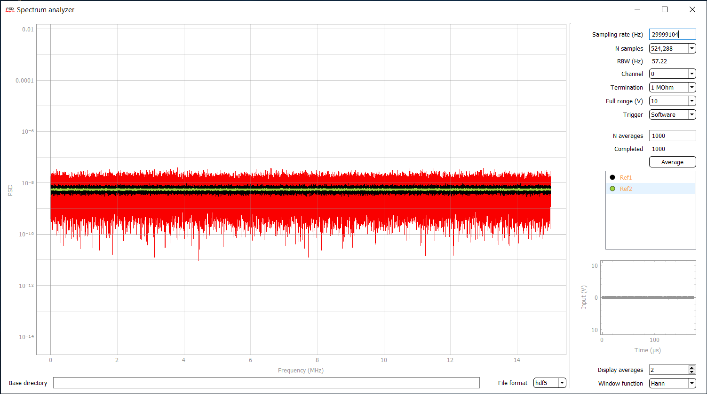

# pyspectrumdaq-rts

A package for data acquisition using [Spectrum Instrumentation](https://spectrum-instrumentation.com/) digitizer cards with a real-time spectrum analyzer app. It extends Ivan Galinskiy's `pyspectrumdaq` by continuous data streaming capabilities and a Qt UI.

Supports multi-channel acquisition, external triggering and clocking, etc.

## Requirements

Command-line usage requires:
* numpy
* numba

Running the spectrum analyzer app also requires:
* pyqtgraph
* pyfftw
* h5py

The software was tested with a M2i.4931-Exp card and pyqtgraph 0.11.0.

Real-time data streaming and FFT calculation at high sampling rates demand some comutational power from the host computer. A 2.5 GHz 4-core CPU should be borderline enough for 30 MS/s rates (which gives 15 MHz Nyquist bandwidth).  

## Installation

The project contains a python package that can be installed from the terminal as normal:

1) Download the project folder locally 
2) Navigate the terminal to the project folder and execute either `pip install .` , in which case the command will copy the files to the standard location of python packages, or `pip install . -e` , in which the command will reference the files in the current directory. 

## Usage examples

### Spectrum analyzer

Starting the real-time spectrum analyzer app:
```python
from pyspectrumdaq import rts

if __name__ == "__main__":
    # The spectrum analyzer uses multiprocessing, so the
    # if __name__ == "__main__" idiom is required.

    # basedir is the default directory for saving traces. It can be changed 
    # later in the UI. acq_settings are passed to Card.set_acquisition
    # The app only works with one channel at a time at the moment.
    rts(basedir="home", acq_settings={channels: (0,), fullranges=(10,)})
```
The look of the UI:


### Command line usage

Simultaneously acquiring one data trace from each of the four channels:

```python
from pyspectrumdaq import Card

# One can use context management ("with" statement) to ensure that 
# the card is closed at the end of the acquisition.
with Card() as adc:
    adc.set_acquisition(channels=[0, 1, 2, 3], 
                        terminations=["1M", "1M", "50", "1M"], 
                        fullranges=[2, 2, 2, 2],
                        pretrig_ratio=0, 
                        nsamples=10**6,
                        samplerate=10**6)             
    adc.set_trigger(mode="soft")  # Software trigger - always on

    data = adc.acquire()
    # `data` now contains a float64 NumPy array, shaped as [nsamples, nchannels]

    # The time stamps for the data record are calculated as
    t = [i/adc.samplerate for i in range(ns)] 
```

Multiple traces can be acquired by repeatedly calling `adc.acquire()` in a loop.
No reconfiguration is needed between acquisitions.

In order not to miss samples between traces, one can acquire data in FIFO mode:
```python
with Card() as adc:
    adc.set_acquisition(mode = "fifo_single", 
                        channels=[0], 
                        terminations=["1M"], 
                        fullranges=[2],
                        pretrig_ratio=0, 
                        nsamples=10**6,
                        samplerate=10**6)             
    adc.set_trigger(mode="soft")

    # Acquires 100 traces with no missed samples in between.
    data_list = [data[:, 0] for data in adc.fifo(100)]
```
The FIFO mode can also be used for indefinitely long real-time streaming of 
data by omitting the numerical argument to the method:
```python
    for data in adc.fifo():
        pass
```
