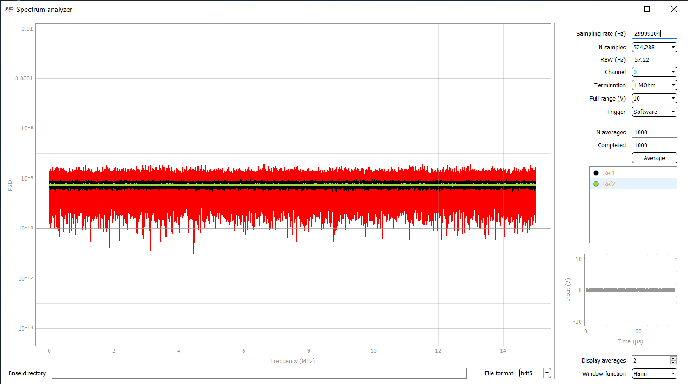

<p align="center">
    
</p>

The package implements a data acquisition interface for [Spectrum Instrumentation](https://spectrum-instrumentation.com/) digitizer cards and includes a real-time spectrum analyzer app. Based on Ivan Galinskiy's [pyspectrumdaq](https://github.com/quantop-dungeon/pyspectrumdaq), it extends the original by continuous data streaming capabilities and a Qt UI.

Supports multi-channel acquisition, external triggering and clocking, etc.

## Requirements

Command-line usage requires:
* numpy
* numba

Running the spectrum analyzer app also requires:
* pyqtgraph 0.11.0
* pyfftw
* h5py

The software was tested with a M2i.4931-Exp card.

Real-time data streaming and FFT calculation at high sampling rates demand some comutational power from the host computer. A 2.5 GHz 4-core CPU should be borderline enough for 30 MS/s rates (which gives 15 MHz Nyquist bandwidth).  

## Installation

The project contains a python package that can be installed from the terminal as normal:

1) Download the project folder locally 
2) Navigate the terminal to the project folder and execute either `pip install .` , in which case the command will copy the files to the standard location of python packages, or `pip install -e .` , in which the command will reference the files in the current directory. 

## Usage examples

### Spectrum analyzer

Starting the real-time spectrum analyzer (RTS) app:
```python
from pyspectrumdaq import rts

if __name__ == "__main__":
    # The spectrum analyzer uses multiprocessing, so the
    # if __name__ == "__main__" idiom is required in the file that starts it.

    # basedir is the default directory for saving traces. It can be changed 
    # later in the UI. Most of acq_settings are passed to Card.set_acquisition
    # The app only works with one channel at a time at the moment.
    rts(basedir="home", acq_settings={"channels": (0,), "fullranges": (10,),
                                      "terminations": ("1M",), "samplerate": 30e6})
```
The look of the UI:


New traces can be acquired by pressing Average button, and the selected trace is saved in the base directory by pressing `ctrl-s`. 

The content of the saved hdf5 file includes the values of the power spectral density at each frequency, the limits necessary to recreate the frequency axis, and some additional metadata. The spectra can be loaded as
```python
import h5py
import numpy as np

with h5py.File("data_file.hdf5", "r") as f:
    psd = f["ydata"][:]  # The slicing is to convert it to a numpy array.
    fmin = f["ydata"].attrs["xmin"]
    fmax = f["ydata"].attrs["xmax"]

freqs = np.linspace(fmin, fmax, len(psd))
```
Inspecting the metadata,
```python

with h5py.File(data_filename, "r") as f:
    mdt = dict(f["ydata"].attrs)
    for k in mdt:
        print(f"{k}: {mdt[k]}")
```
one can see something something like
```
acquisition:channels: [1]
acquisition:fullranges: [0.5]
acquisition:mode: fifo_single
acquisition:nsamples: 524288
acquisition:samplerate: 30000000
acquisition:terminations: ['50']
acquisition:trig_mode: soft
acquisition:window: Hann
n averages: 1000
xlabel: Frequency (Hz)
xmax: 15000000.0
xmin: 0.0
ylabel: PSD (V^2/Hz)
```

### Baseband data acquisition from a script or notebook

The code for concurrent acquisition of one data trace from each of the four input channels:

```python
from pyspectrumdaq import Card

# One can use context management ("with" statement) to ensure that 
# the card is closed at the end of the acquisition.
with Card() as adc:
    adc.set_acquisition(channels=[0, 1, 2, 3], 
                        terminations=["1M", "1M", "50", "1M"], 
                        fullranges=[2, 2, 2, 2],
                        pretrig_ratio=0, 
                        nsamples=10**6,
                        samplerate=10**6)             
    adc.set_trigger(mode="soft")  # Software trigger - always on

    data = adc.acquire()
    # `data` now contains a float64 NumPy array, shaped as [nsamples, nchannels]

    # The time stamps for the data record are calculated as
    t = [i/adc.samplerate for i in range(ns)] 
```

Multiple traces can be acquired by repeatedly calling `adc.acquire()` in a loop.
No reconfiguration is needed between acquisitions.
The number of samples missed between traces will be small but random.

In order not to miss samples between traces, one can acquire data in FIFO mode:
```python
with Card() as adc:
    adc.set_acquisition(mode = "fifo_single", 
                        channels=[0], 
                        terminations=["1M"], 
                        fullranges=[2],
                        pretrig_ratio=0, 
                        nsamples=10**6,
                        samplerate=10**6)             
    adc.set_trigger(mode="soft")

    # Acquires 100 traces with no missed samples in between.
    data_list = [data[:, 0] for data in adc.fifo(100)]
```
The FIFO mode can also be used for indefinitely long real-time data streaming by omitting the numerical argument to the method:
```python
    for data in adc.fifo():
        pass
```

### Digital demodulation
While digitalization at the full sampling frequency can produce high volumes of data, sometimes the signals of interest are contained within a narrow spectral region. This spectral region can be selected via digital demodulation followed by low-pass filtering, which reduces the amount of data to be processed and saved. 

```python
import numpy as np
from scipy import signal

nsamples = 3 * 10**5
samplerate = 15 * 10**6
fdemod = 0.93e6  # demodulation frequency
flp = 10**5  # demodulation lowpass cutoff

# Makes a filter
sos = signal.butter(6, flp, btype="lowpass", fs=samplerate, output="sos", 
                    analog=False)

samplerate_ratio = samplerate // (6 * flp)
dt = 1/samplerate

# The time stamps for the data record
t = np.array([i*dt for i in range(nsamples)]) 

# The demodulation exponential
exp_tr = np.exp(2j * pi * fdemod * t)

with Card() as adc:
    adc.set_acquisition(mode="std_single",
                        channels=[1], 
                        terminations=["50"], 
                        fullranges=[2],
                        pretrig_ratio=0.0, 
                        nsamples=nsamples,
                        samplerate=samplerate)             
    adc.set_trigger(mode="soft")

    # Acquires one raw data trace
    sig = adc.acquire()[:, 0]
    
    # Demodulates, filters and downsamples
    demod_sig = sig * exp_tr
    filtered_sig = signal.sosfilt(sos, demod_sig)[::samplerate_ratio]
    # The interval between the time stamps for filtered_sig 
    # is dt * samplerate_ratio
```
### More
See the files in the [examples](examples) folder.
